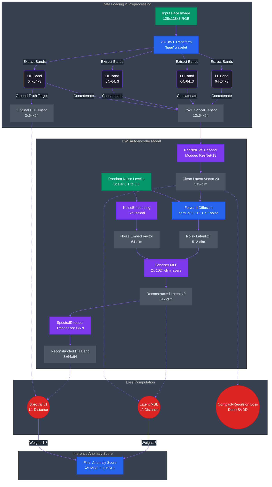

# DWTAutoencoder Architecture Dataflow

The following diagram maps out the flow of data through the entire DWT Autoencoder Presentation Attack Detection model, from the raw image input down to the calculated loss components.

