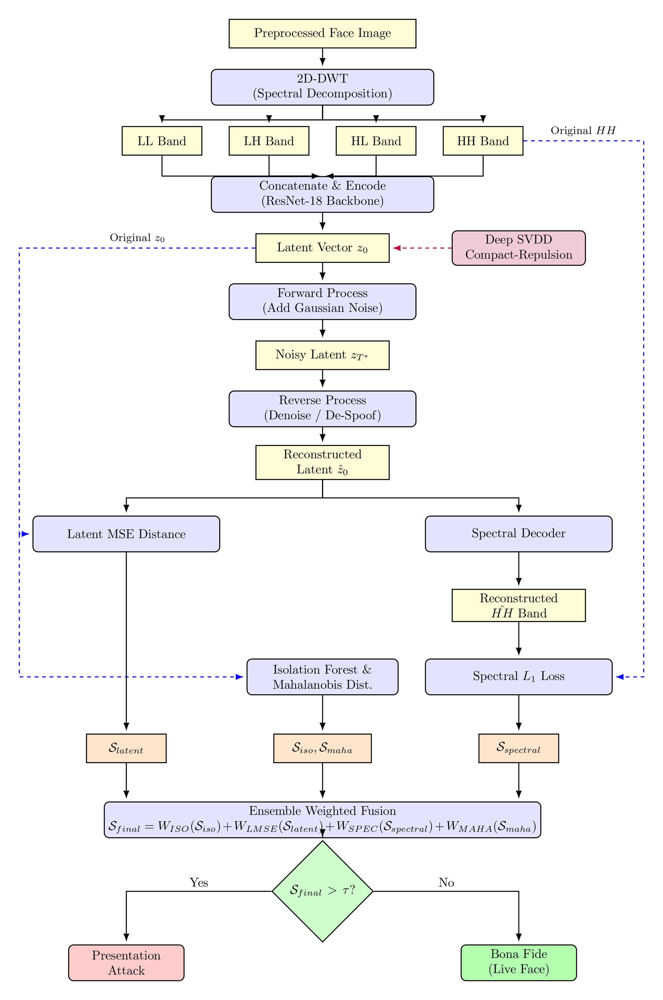
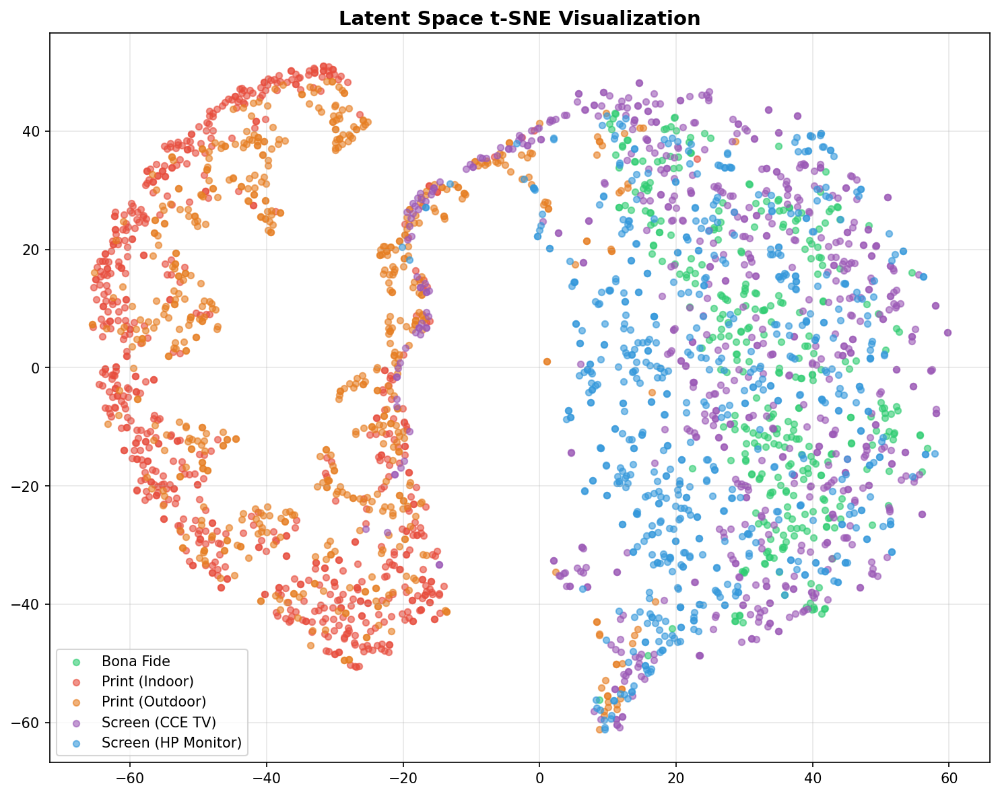

# Latent Spectral Diffusion for Open-Set Face Anti-Spoofing


Traditional Face Presentation Attack Detection (PAD) models act as memorization engines, succeeding against known attacks but failing catastrophically against novel, unseen threats (Open-Set scenarios). 

This repository contains the implementation of the **AOPAD (Autoencoder-based Open-Set PAD)** framework. Instead of treating PAD as a spatial classification problem, this project models it as a **frequency-domain anomaly detection** problem. By combining 2D-Discrete Wavelet Transforms (DWT) with a diffusion-inspired denoising autoencoder, the model strictly learns the mathematical definition of a *Bona-Fide* (genuine) face, rejecting physical and digital spoofing attempts as out-of-distribution anomalies.

## 🌟 Key Features
* **Spectral Decomposition:** Utilizes 2D-DWT to isolate high-frequency spoofing artifacts (like moiré patterns or printer ink dots) from low-frequency facial structural data.
* **Diffusion-Inspired Denoising:** Prevents identity memorization by injecting Gaussian noise into the latent space and forcing an MLP to reconstruct the clean manifold.
* **Targeted Spectral Decoding:** The decoder is tasked *only* with reconstructing the high-frequency (`HH`) wavelet band, amplifying reconstruction errors on unnatural spoofing textures.
* **Deep SVDD & Margin Repulsion:** A custom multi-objective loss that pulls real faces into a tight cluster while repelling known attacks outside a defined margin.

---

## 🧠 System Architecture & Working Pipeline



The framework processes incoming presentations through five distinct phases:

### 1. Preprocessing (2D-DWT)
Standard RGB inputs are converted into the frequency domain using a Haar wavelet 2D-DWT. This yields four sub-bands: `LL` (structural approximation), `LH`, `HL` (directional edges), and `HH` (diagonal high-frequency detail). Presentation attacks inherently exhibit amplified, unnatural noise in the `HH` band due to hardware limitations (e.g., pixel grids on screens, ink droplets on paper).

### 2. Latent Encoding
The 12-channel concatenated DWT tensor is passed into a custom **ResNet-18** backbone. The network does not classify the image; instead, it compresses the spatial frequencies into a highly constrained 128-dimensional latent vector ($z_0$).

### 3. Forward-Reverse Diffusion
To force the network to learn invariant genuine features, random Gaussian noise is added to $z_0$ (Forward Process). A Denoising Multi-Layer Perceptron (Reverse Process) attempts to filter out this noise and reconstruct the clean latent representation ($\hat{z}_0$).

### 4. High-Frequency Spectral Decoding
A transposed Convolutional Neural Network (CNN) takes the cleaned latent vector and attempts to reconstruct **only the original HH band**. If the input is a genuine face, the reconstruction succeeds. If the input is a screen replay or a printed photo, the compressed latent space cannot mathematically reconstruct the chaotic moiré patterns, resulting in massive reconstruction failure.

### 5. Ensemble Anomaly Scoring
During inference, a final anomaly score ($S_{final}$) is calculated using an ensemble weighted fusion of four metrics. If $S_{final}$ exceeds a calibrated threshold $\tau$, the system flags a Presentation Attack.
* **Latent MSE:** Error in the denoiser reconstruction.
* **Spectral L1:** Error in the `HH` band reconstruction.
* **Isolation Forest:** Structural outlier detection in the latent space.
* **Mahalanobis Distance:** Statistical distance from the Bona-Fide centroid.

---

## 🧮 Multi-Objective Loss Formulation

The network is optimized using a simultaneous four-part objective:

1. **Latent Constraint:** $$\mathcal{L}_{latent} = ||z_0 - \hat{z}_0||_2^2$$

2. **Spectral Constraint:** $$\mathcal{L}_{spec} = ||HH_{orig} - HH_{recon}||_1$$

3. **Compactness (Deep SVDD):** Pulls Bona-Fide ($N_b$) samples to a centroid $c$.

   $$\mathcal{L}_{compact} = \frac{1}{N_b}\sum_{i=1}^{N_b}||z_i - c||_2^2$$

4. **Repulsion Margin:** Forces the single known attack ($N_a$) outside a margin $m$.

   $$\mathcal{L}_{repel} = \frac{1}{N_a}\sum_{i=1}^{N_a}\max(0, m - ||z_i^{attack} - c||_2)^2$$
   
---

## 📊 Dataset & Protocol
This project utilizes the **RECOD-MPAD** dataset under a strict Open-Set protocol partitioned by User IDs to prevent data leakage.
* **Training:** 30 Subjects (Bona-Fide + 1 Known Attack: Indoor Print)
* **Validation:** 7 Subjects
* **Testing:** 8 Subjects against **Unseen** Attacks (Outdoor Print, CCE TV Screen, HP Monitor Screen).

---

## 🚀 Results

The model exhibits exceptional zero-shot domain generalization against physical artifacts (unseen print attacks yielded an EER of **1.18%**). Screen replays pose a harder challenge due to complex moiré patterns mimicking facial structures in lower frequencies.

| Metric | Overall Performance |
| :--- | :--- |
| **ACER** | 20.84% |
| **BPCER** | 6.34% |
| **APCER** | 35.33% |
| **EER** | 23.75% |
| **AUC-ROC** | 0.8479 |


*t-SNE visualization of the bottleneck latent space. Notice the total isolation of physical print attacks (red/orange) from the genuine manifold (green).*

---

## 📁 Repository Structure

```text
├── data/                   # Data loaders and DWT preprocessing scripts
├── models/                 # ResNet Encoder, Denoiser, and Spectral Decoder definitions
├── utils/                  # Loss functions, scoring, and metrics calculation
├── train.py                # Main two-phase training loop
├── evaluate.py             # Inference, threshold calibration, and testing script
├── requirements.txt        # Python dependencies
└── README.mdm
```
--- 

## ⚙️ Installation & Usage

### 1. Clone the repository:

```bash
git clone [https://github.com/yourusername/AOPAD-Spectral-Diffusion.git](https://github.com/yourusername/AOPAD-Spectral-Diffusion.git)
cd AOPAD-Spectral-Diffusion
```

### 2. Install dependencies:

```bash
pip install -r requirements.txt
```

### 3. Run the training script (ensure your dataset is configured in data/):

```bash
python train.py --batch_size 32 --epochs 80
```

### 4. Evaluate the model:

```bash
python evaluate.py --weights path/to/saved_model.pth
```

---

## 📖 Citation
If you find this code or methodology useful, please consider citing the baseline architecture paper:

```text
I. Bastos, A. George, S. Marcel, and A. Rocha, "Autoencoders for Open-Set Presentation Attack Detection," IEEE Transactions on Biometrics, Behavior, and Identity Science, pp. 1-1, 2026. doi: 10.1109/TBIOM.2026.3651671.
```
